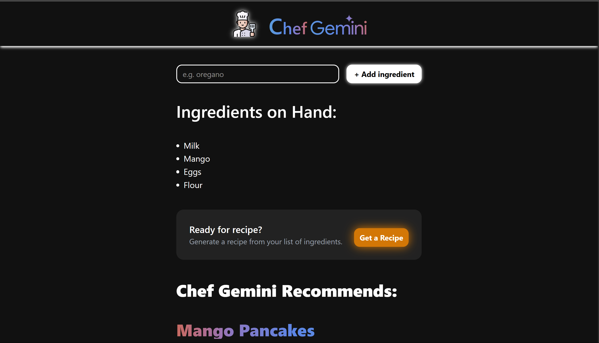
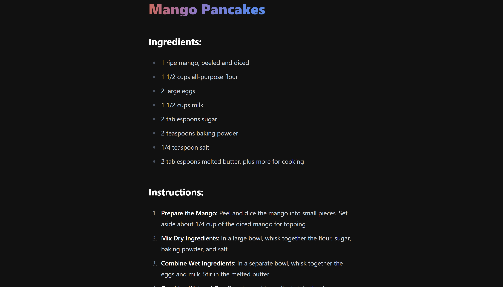

# 🍽️ Chef Claude

<p align="center">
  
</p>


## 📖 Description

Chef Claude is a delightful recipe finder application that helps users discover new recipes based on their available ingredients. With a clean and intuitive interface, users can easily search for recipes, view cooking instructions, and enjoy a seamless culinary experience.

## ✨ Features

- 🔍 **Genetate recipes by ingredients** - Genetate recipes based on what you already have.
- 📋 **Detailed recipe instructions** - Follow clear, step-by-step cooking guides
- 🌙 **Dark mode support** - Comfortable viewing experience day or night
- 📱 **Responsive design** - Works on desktop, tablet, and mobile devices

## 🖥️ Screenshots

<p align="center">
  
  &nbsp; &nbsp;
  
</p>

## 🛠️ Technologies Used

- **React.js** - Frontend library for building user interfaces
- **Typescript** - Javascript superset for static type-checking
- **TailwindCSS** - Styling and responsive design
- **Vite** - Build tool for modern web development

## 🚀 Installation

1. Clone the repository:
```bash
git clone https://github.com/yourusername/chefClaude.git
cd chefClaude
```

2. Install dependencies:
```bash
pnpm install
```

3. Start the development server:
```bash
pnpm dev
```

4. Open your browser and navigate to:
```
http://localhost:3000
```

## 💻 Usage

1. **Generate Recipe:**
   - Add ingredients you have in the list
   - Get a recommended recipe based on your ingredients from Chef Gemini

2. **View Recipe Details:**
   - Click on any recipe card to see detailed instructions
   - Follow the step-by-step preparation guide

## 🧩 Project Structure

```
chefClaude/
├── public/
│   ├── index.html
│   └── assets/
├── src/
│   ├── components/
│   ├── context/
│   ├── pages/
│   ├── utils/
│   ├── App.js
│   └── index.js
└── package.json
```

## 👨‍🍳 About the Developer

Chef Claude was developed with love and passion for both coding and cooking!

---

<p align="center">
  Made with ❤️ by Mayank
</p>
